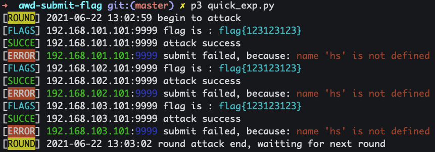

# awd-submit-flag


更新内容：

> 因为在实际比赛时争分夺秒，原版的功能太多，太过于笨重，所以在原有的版本上，添加了一个快速版
>
> 原版本移至[standward](./standward/)文件夹中


## 快速版


### 说明

该项目主要是用来在AWD比赛中批量自动提交flag时使用的。


### 依赖

* python2或python3均可
* requests（web题依赖，pip安装即可）
* pwntools（pwn题依赖，pip安装即可）

> 建议大家pwn和web的环境都安装上，不然py过来的脚本可能跑不起来，想象一下四个web手拿到pwn脚本束手无策的情况。。。。


### 使用方法

修改好`quick_exp.py`，之后直接`python quick_exp.py`即可。

**修改内容**：

```c
1、根据pwn或web题目类型，取消开头import注释
2、main函数中的range范围、ip、port
3、attack函数中payload内容
4、submit函数中curl链接、token格式、flag格式
```


**运行效果**

```shell
➜  awd-submit-flag git:(master) ✗ p3 quick_exp.py
[ROUND] 2021-06-22 13:02:59 begin to attack
[FLAGS] 192.168.101.101:9999 flag is : flag{123123123}
[SUCCE] 192.168.101.101:9999 attack success
[ERROR] 192.168.101.101:9999 submit failed, because: name 'hs' is not defined
[FLAGS] 192.168.102.101:9999 flag is : flag{123123123}
[SUCCE] 192.168.102.101:9999 attack success
[ERROR] 192.168.102.101:9999 submit failed, because: name 'hs' is not defined
[FLAGS] 192.168.103.101:9999 flag is : flag{123123123}
[SUCCE] 192.168.103.101:9999 attack success
[ERROR] 192.168.103.101:9999 submit failed, because: name 'hs' is not defined
[ROUND] 2021-06-22 13:03:02 round attack end, waitting for next round
```




### 注意事项：

* attack中的remote或request必须设置timeout

* flag一定要print测试，看flag的内容是否存在问题

* 正式运行时将pwntools的debug关闭，减少回显

* 仔细看attack中demo的注释

* 提前使用`env_test`环境来提前进行测试，防止比赛现场出现问题。

  

## 标准版

标准版的README已转移到

 [README-standward.md](./README-standward.md) 

